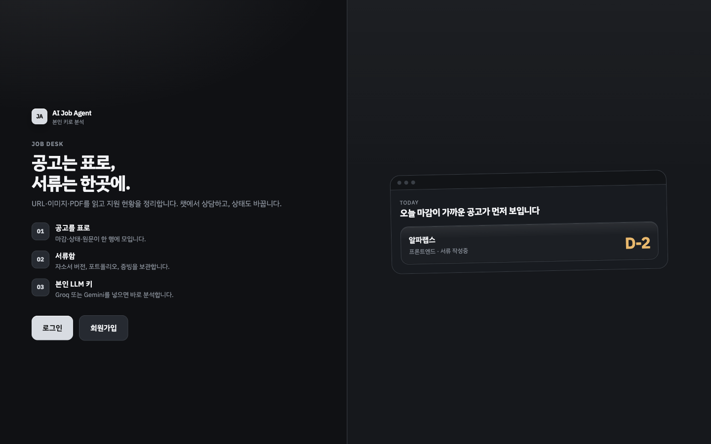
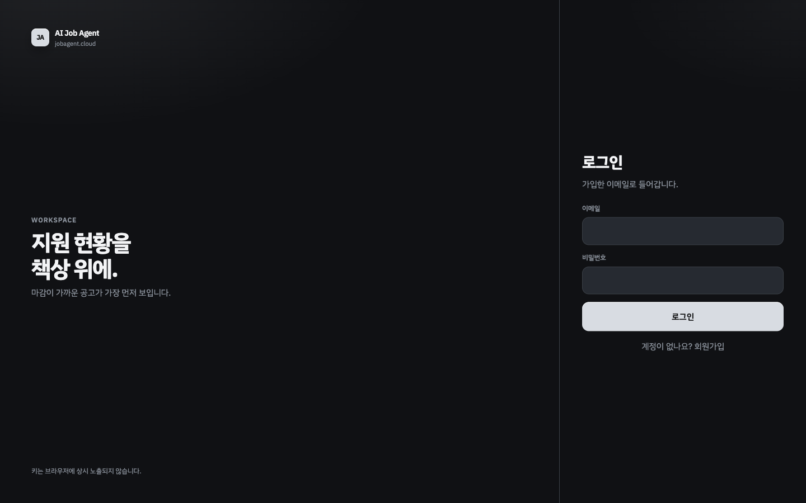
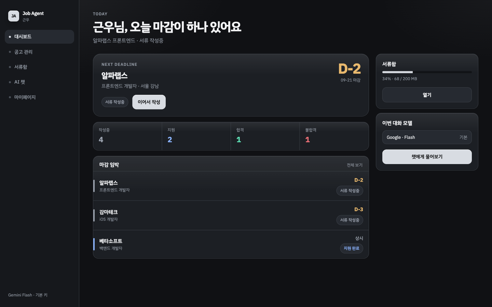
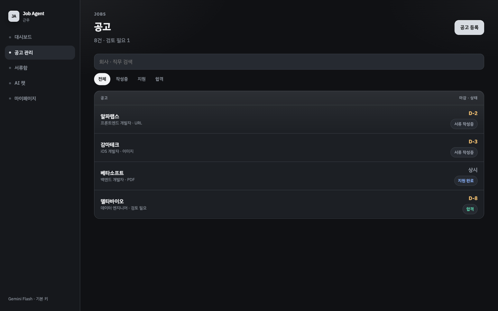
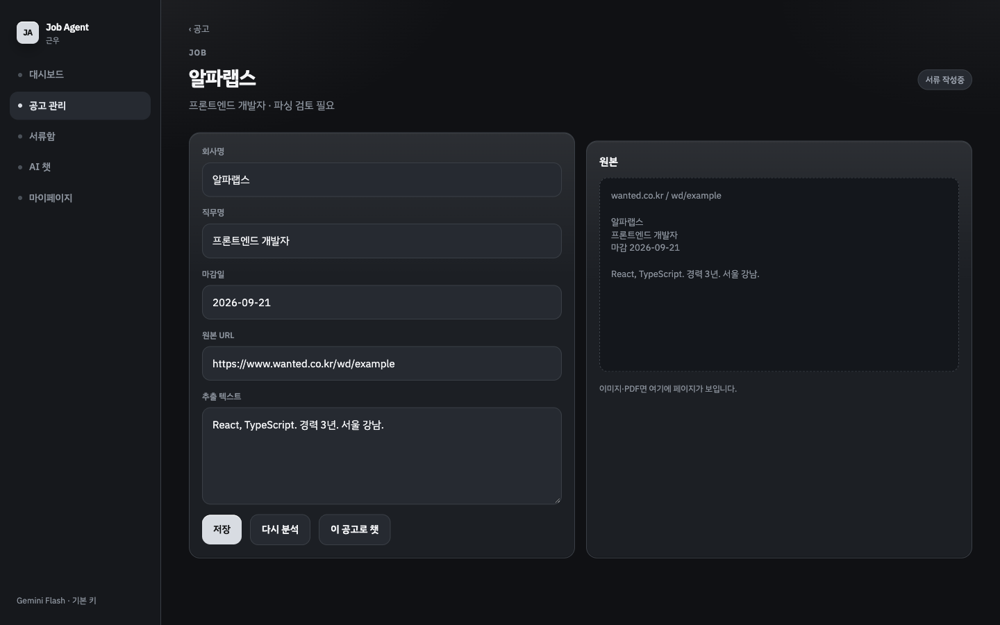
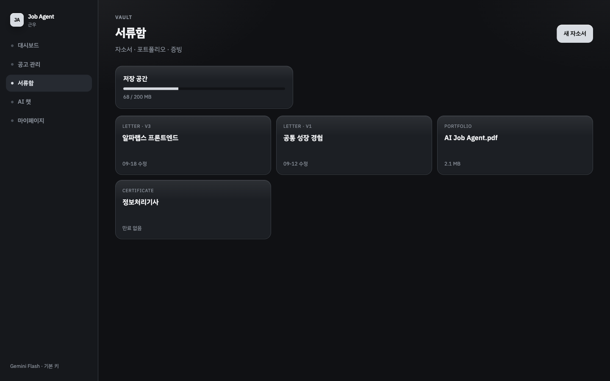
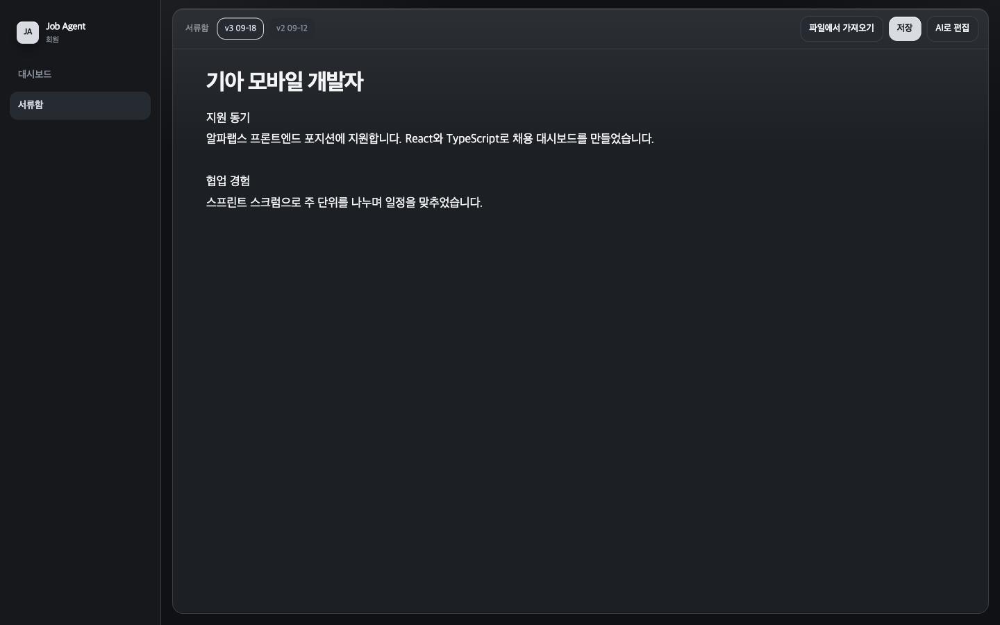
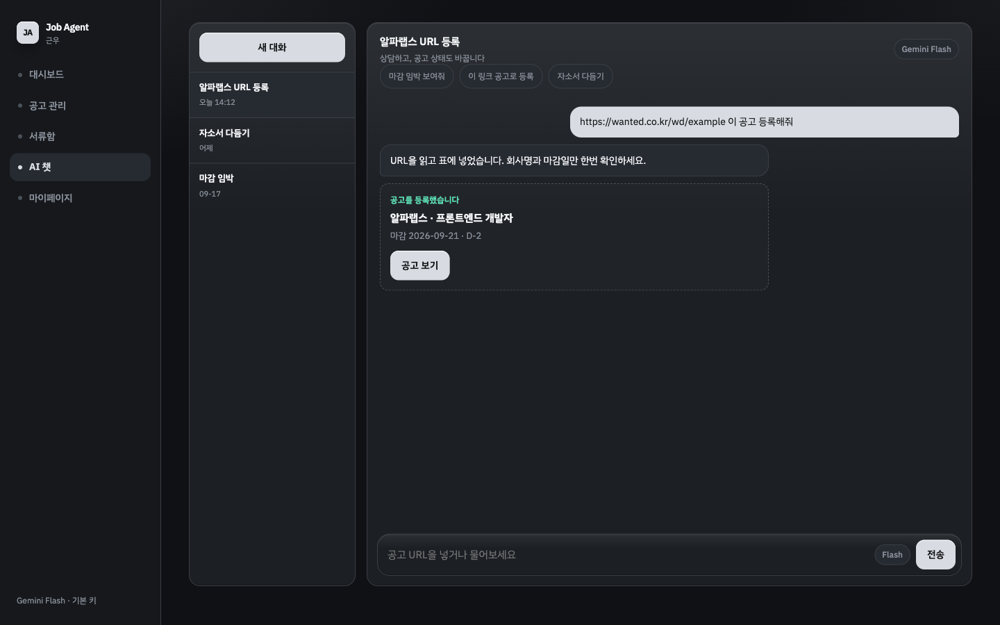
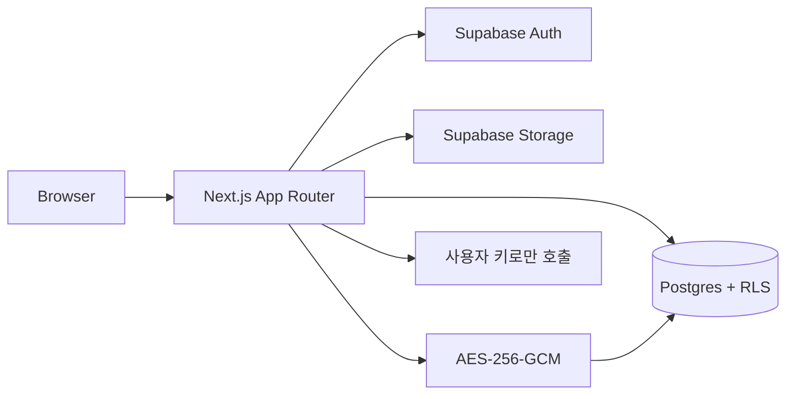

# AI Job Agent

**본인 LLM 키로 공고를 읽고, 지원 현황과 자소서를 한 책상에 모으는 취준 워크스페이스.**

[jobagent.cloud](https://jobagent.cloud)에서 실제로 돌아갑니다.

<p align="center">
  
</p>

채용 공고는 회사마다 HTML·이미지·PDF·자바스크립트 데이터 파일이 제각각입니다. 엑셀에 붙여 넣고, 자소서는 폴더에 흩어지고, 마감은 캘린더 알림에 맡기는 흐름을 한 서비스로 묶었습니다. 분석 비용은 서비스 키가 아니라 **사용자가 등록한 LLM 키**로만 나갑니다.

---

## 무엇을 풀었나

| 이전 | 이 서비스 |
| --- | --- |
| 공고 페이지를 스크롤하며 마감·자격을 손으로 옮김 | URL·포스터·PDF를 넣으면 회사·직무·마감·자격·전형이 표로 남음 |
| 자소서 파일이 메일함·드라이브에 흩어짐 | 서류함에서 버전을 쌓고, 공고 맥락으로 새 초안을 받음 |
| “이 공고 어떻게 준비하지”를 일반 챗봇에 물어봄 | 저장된 JD만 근거로 상담. 없는 내용은 추정하지 않음 |

<p align="center">
  
</p>

---

## 화면으로 보는 제품

### 오늘 할 일이 먼저 보이는 대시보드

마감이 가까운 공고, 지원 상태 집계, 기본 LLM, 서류함 용량이 한 화면에 있습니다. 빈 화면이 아니라 **지금 손대야 할 공고**가 제목입니다.

<p align="center">
  
</p>

### 공고는 표, 상세는 고칠 수 있는 분석 결과

URL / 이미지 / PDF로 등록합니다. 모델이 뽑은 회사명·직무·마감·본문은 저장되고, 사람이 고친 값이 이깁니다. 직무가 여러 개면 칩으로 고릅니다. `석·박사`처럼 가운뎃점이 들어간 과정명은 쪼개지 않습니다.

<p align="center">
  
</p>

<p align="center">
  
</p>

한국 채용 사이트는 본문이 HTML이 아닌 경우가 많습니다. 예를 들어 통이미지 포스터는 페이지에서 JPEG를 골라 비전으로 읽고, JD가 `data/*.js`에 들어 있는 전형은 같은 출처 스크립트를 가져와 텍스트로 붙인 뒤 추출합니다. 본문이 충분하면 이미지 토큰은 보내지 않습니다.

### 서류함과 마크다운 자소서 편집기

자소서·포트폴리오·증빙을 보관합니다. 자소서는 Notion처럼 제목·목록·강조를 쓰는 WYSIWYG이고, 자동 저장은 현재 버전을 덮어쓰며 **버전 저장**만 새 번호를 만듭니다. AI 초안은 별도 화면입니다. PDF/DOCX 가져오기는 파일을 텍스트로만 풀고, 모델은 타지 않습니다.

<p align="center">
  
</p>

<p align="center">
  
</p>

등록된 공고 섹션과 이전에 쓴 자소서만 근거로 새 본문을 씁니다. 공고에 없는 복지·전형을 지어내지 않도록 프롬프트를 제한합니다.

### 공고를 읽고 상태를 바꾸는 챗

상담만 하지 않습니다. `get_job`으로 저장된 자격·전형·직무 요약을 읽은 뒤에만 조언하고, URL을 주면 공고를 등록합니다. 답은 마크다운입니다. Gemini 계열의 function calling에 필요한 `thoughtSignature`도 서버에서 이어 줍니다.

<p align="center">
  
</p>

달력에는 마감과 개인 일정·계획 범위를 같이 둡니다.

---

## 구조를 이렇게 짠 이유



**BYOK.** 분석·자소서·챗 비용은 사용자 키로만 청구됩니다. 키는 서버에서만 복호화하고 LLM 공급자에 전달합니다. 브라우저에는 `key_last4`만 보입니다.

**공고는 사실, 챗은 그 사실만.** 추출 결과는 `parsed_json` 섹션(자격·전형·복지·근무지·직무별 요약)으로 저장합니다. 챗이 제목만 보고 업무를 추측하지 못하게 `get_job`을 강제합니다.

**토큰은 품질을 해치지 않는 선에서 자릅니다.** HTML 상한, 본문이 충분하면 비전 생략, 섹션이 있으면 본문 중복 제거, 대화 최근 8턴. 출력 한도는 자소서 초안이 잘리지 않도록 별도로 둡니다.

**보안 기본값.** HTTPS, Supabase RLS로 본인 행만, 업로드 MIME·10MB·용량 쿼터, LLM 호출 레이트 리밋, 공고 URL SSRF 가드.

---

## 스택

| 영역 | 선택 |
| --- | --- |
| 앱 | Next.js 16 App Router, React 19, TypeScript |
| UI | IBM Plex Sans KR, 메탈릭 그레이 토스형 팔레트, Tiptap 마크다운 편집기 |
| 데이터 | Supabase Auth / Postgres / Storage (Seoul) |
| LLM | 사용자 키 · OpenAI 호환 + Anthropic + Google (Groq, Gemini, xAI 등) |
| 파일 | PDF 텍스트 레이어(`unpdf`), DOCX(`fflate`), 이미지는 멀티모달 |
| 운영 | Ubuntu + PM2 + Cloudflare Tunnel · [jobagent.cloud](https://jobagent.cloud) |

단위 테스트는 `lib/**/*.test.ts`를 Node로 돌립니다. `npm test`.

---

## 로컬 실행

```bash
cp .env.example .env.local
# NEXT_PUBLIC_SUPABASE_URL, publishable key, APP_KMS_KEY 채우기
npm install
npm run dev
```

개발 중 이메일 확인을 끄려면 Supabase → Authentication → Providers → Email → Confirm email.

실키·`.env`는 커밋하지 않습니다. 템플릿만 [`.env.example`](.env.example)입니다.

---

## 설계 문서

구현 전에 적어 둔 계약입니다. 화면은 이 문서보다 제품 스크린샷이 최신입니다.

| 문서 | 내용 |
| --- | --- |
| [docs/requirements.md](docs/requirements.md) | 범위, FR/NFR |
| [docs/ia.md](docs/ia.md) | 라우트와 사용자 플로우 |
| [docs/schema.md](docs/schema.md) | ERD, DDL, RLS |
| [docs/extraction.md](docs/extraction.md) | 공고 추출 JSON |
| [docs/chat.md](docs/chat.md) | 챗 도구 |
| [docs/tech-stack.md](docs/tech-stack.md) | 스택 결정 근거 |
| [docs/style-guide.md](docs/style-guide.md) | 비주얼 언어 |

Figma: [AI Job Agent UI](https://www.figma.com/design/h2QO4acl8ycqFDE5QAdl3q)
